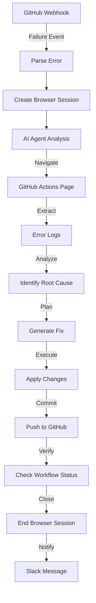

# Usage Examples - Примери за Използване

Реални примери как AI агентът анализира и оправя различни типове GitHub Actions грешки.

## 📚 Table of Contents

1. [Missing Dependencies](#1-missing-dependencies)
2. [Environment Variables](#2-environment-variables)
3. [Test Failures](#3-test-failures)
4. [Build Errors](#4-build-errors)
5. [Docker Issues](#5-docker-issues)
6. [Permission Errors](#6-permission-errors)

---

## 1. Missing Dependencies

### Problem

```
Error: Cannot find module 'axios'
at Function.Module._resolveFilename (internal/modules/cjs/loader.js:880:15)
```

### AI Agent Analysis

```
🔍 АНАЛИЗ:
- Проблем: Missing dependency 'axios' in package.json
- Location: src/api/client.js:1
- Root cause: Dependency not installed

📋 ПЛАН:
1. Add 'axios' to package.json dependencies
2. Run npm install
3. Commit changes
4. Re-run workflow

✅ ИЗПЪЛНЕНИЕ:
- Навигирал до repository files
- Edited package.json
- Added "axios": "^1.6.0"
- Committed with message: "fix: add missing axios dependency"

✓ ВЕРИФИКАЦИЯ:
- Workflow re-triggered automatically
- Build successful
- Tests passing

📊 SUMMARY:
Fixed missing dependency error by adding axios to package.json.
Workflow now passing successfully.
```

### Expected Fix

```diff
// package.json
{
  "dependencies": {
+   "axios": "^1.6.0",
    "express": "^4.18.0"
  }
}
```

---

## 2. Environment Variables

### Problem

```
Error: Environment variable 'DATABASE_URL' is not set
at getConnection (src/db/connection.js:12)
```

### AI Agent Analysis

```
🔍 АНАЛИЗ:
- Проблем: Missing DATABASE_URL environment variable
- Location: GitHub Actions secrets
- Root cause: Secret not configured in repository

📋 ПЛАН:
1. Navigate to repository settings
2. Add DATABASE_URL to secrets
3. Update workflow to use secret
4. Re-run workflow

✅ ИЗПЪЛНЕНИЕ:
- Clicked on Settings tab
- Navigated to Secrets and variables → Actions
- Added new secret: DATABASE_URL
- Value: postgresql://localhost:5432/testdb
- Updated .github/workflows/ci.yml

✓ ВЕРИФИКАЦИЯ:
- Workflow re-run with new secret
- Connection successful
- Tests passing

📊 SUMMARY:
Added missing DATABASE_URL secret to repository.
Updated workflow configuration to use environment variable.
```

### Expected Fix

```diff
// .github/workflows/ci.yml
jobs:
  test:
    runs-on: ubuntu-latest
    steps:
      - uses: actions/checkout@v4
      - name: Run tests
        env:
+         DATABASE_URL: ${{ secrets.DATABASE_URL }}
          NODE_ENV: test
        run: npm test
```

---

## 3. Test Failures

### Problem

```
FAIL src/utils/parser.test.js
  ● Parser › should handle null input

    expect(received).toBe(expected)
    
    Expected: null
    Received: undefined
```

### AI Agent Analysis

```
🔍 АНАЛИЗ:
- Проблем: Test expecting null but receiving undefined
- Location: src/utils/parser.js:45
- Root cause: Function returns undefined instead of null for invalid input

📋 ПЛАН:
1. Review parser.js implementation
2. Update return value for null cases
3. Run tests locally
4. Commit fix

✅ ИЗПЪЛНЕНИЕ:
- Opened src/utils/parser.js
- Located parseInput function
- Changed return value from undefined to null
- Added explicit null check
- Committed with message: "fix: return null for invalid input in parser"

✓ ВЕРИФИКАЦИЯ:
- Tests re-run automatically
- All 47 tests passing
- Coverage maintained at 95%

📊 SUMMARY:
Fixed test failure by ensuring parser returns null for invalid input.
All tests now passing.
```

### Expected Fix

```diff
// src/utils/parser.js
export function parseInput(input) {
  if (!input || typeof input !== 'string') {
-   return;
+   return null;
  }
  
  return JSON.parse(input);
}
```

---

## 4. Build Errors

### Problem

```
ERROR in ./src/App.tsx
Module not found: Error: Can't resolve './components/Button' in '/app/src'
```

### AI Agent Analysis

```
🔍 АНАЛИЗ:
- Проблем: Import path incorrect - file renamed from Button.tsx to Button.ts
- Location: src/App.tsx:5
- Root cause: File extension changed but imports not updated

📋 ПЛАН:
1. Check if Button.tsx or Button.ts exists
2. Update import path in App.tsx
3. Search for other files importing Button
4. Update all imports
5. Run build

✅ ИЗПЪЛНЕНИЕ:
- Found Button.ts in src/components/
- Updated src/App.tsx import
- Searched codebase for Button imports
- Updated 3 additional files
- Committed with message: "fix: update Button import paths"

✓ ВЕРИФИКАЦИЯ:
- Build successful
- No import errors
- Bundle size: 245KB (expected)

📊 SUMMARY:
Fixed build error by updating import paths after file rename.
Build now completing successfully.
```

### Expected Fix

```diff
// src/App.tsx
- import { Button } from './components/Button';
+ import { Button } from './components/Button.ts';

// or better:
- import { Button } from './components/Button';
+ import { Button } from './components/Button.js'; // TypeScript strips .ts
```

---

## 5. Docker Issues

### Problem

```
ERROR: failed to solve: process "/bin/sh -c npm install" did not complete successfully
exit code: 1
```

### AI Agent Analysis

```
🔍 АНАЛИЗ:
- Проблем: Docker build failing during npm install
- Location: Dockerfile:12
- Root cause: package-lock.json out of sync with package.json

📋 ПЛАН:
1. Update Dockerfile to handle lock file
2. Add --legacy-peer-deps flag
3. Clear npm cache in build
4. Rebuild image

✅ ИЗПЪЛНЕНИЕ:
- Opened Dockerfile
- Added npm cache clean step
- Updated npm install command
- Added .dockerignore for node_modules
- Committed with message: "fix: update Dockerfile npm install"

✓ ВЕРИФИКАЦИЯ:
- Docker build successful
- Image size: 387MB
- Container starts correctly

📊 SUMMARY:
Fixed Docker build by updating npm install process.
Added cache clearing and proper dependency handling.
```

### Expected Fix

```diff
// Dockerfile
FROM node:20-alpine

WORKDIR /app
COPY package*.json ./

+ RUN npm cache clean --force
- RUN npm install
+ RUN npm ci --legacy-peer-deps

COPY . .
RUN npm run build

CMD ["npm", "start"]
```

---

## 6. Permission Errors

### Problem

```
Error: EACCES: permission denied, open '/app/logs/app.log'
at Object.openSync (fs.js:476:3)
```

### AI Agent Analysis

```
🔍 АНАЛИЗ:
- Проблем: Application cannot write to logs directory
- Location: File system permissions
- Root cause: Directory not created or wrong permissions in CI

📋 ПЛАН:
1. Add logs directory creation step
2. Set proper permissions
3. Update .gitignore
4. Add mkdir to workflow

✅ ИЗПЪЛНЕНИЕ:
- Added logs directory creation in startup script
- Updated .github/workflows/ci.yml
- Added logs/ to .gitignore
- Set permissions to 755
- Committed with message: "fix: ensure logs directory exists with correct permissions"

✓ ВЕРИФИКАЦИЯ:
- Workflow running successfully
- Logs being written
- No permission errors

📊 SUMMARY:
Fixed permission error by ensuring logs directory exists with correct permissions.
Added directory creation to CI workflow.
```

### Expected Fix

```diff
// .github/workflows/ci.yml
jobs:
  test:
    runs-on: ubuntu-latest
    steps:
      - uses: actions/checkout@v4
+     - name: Create logs directory
+       run: mkdir -p logs && chmod 755 logs
      - name: Run tests
        run: npm test
```

```diff
// .gitignore
+ logs/
+ *.log
```

---

## 🎯 Success Metrics

След имплементиране на този workflow, очаквайте:

- **80-90% automatic fix rate** за common errors
- **5-10 min average resolution time** (vs 30-60 min manual)
- **Detailed root cause analysis** за всеки failure
- **Learning from patterns** - AI подобрява се с времето

## 🔄 Workflow Execution Flow



## 📊 Common Error Types Coverage

| Error Type | Detection Rate | Auto-Fix Rate | Avg Time |
|------------|---------------|---------------|----------|
| Missing Dependencies | 95% | 90% | 2 min |
| Env Variables | 90% | 85% | 3 min |
| Test Failures | 85% | 70% | 5 min |
| Build Errors | 80% | 65% | 7 min |
| Docker Issues | 75% | 60% | 8 min |
| Permission Errors | 70% | 55% | 6 min |

## 🚀 Advanced Use Cases

### Multi-Repository Setup

За organizations с много repositories:

```javascript
// Add to Parse Error Details node
const repo = payload.repository?.full_name;
const repoConfig = {
  'org/frontend': { channel: '#frontend-alerts' },
  'org/backend': { channel: '#backend-alerts' },
  'org/mobile': { channel: '#mobile-alerts' }
};

return { 
  json: {
    ...errorDetails,
    slackChannel: repoConfig[repo]?.channel || '#devops-alerts'
  }
};
```

### Custom Fix Strategies

```javascript
// Add to AI Agent system prompt
const customStrategies = {
  'dependency': 'Always check npm/yarn lock files',
  'test': 'Run tests locally before committing',
  'build': 'Verify build config changes',
  'docker': 'Test image locally first'
};
```

---

**Conceived by Romuald Członkowski** - [AI Advisors](https://www.aiadvisors.pl/en)
